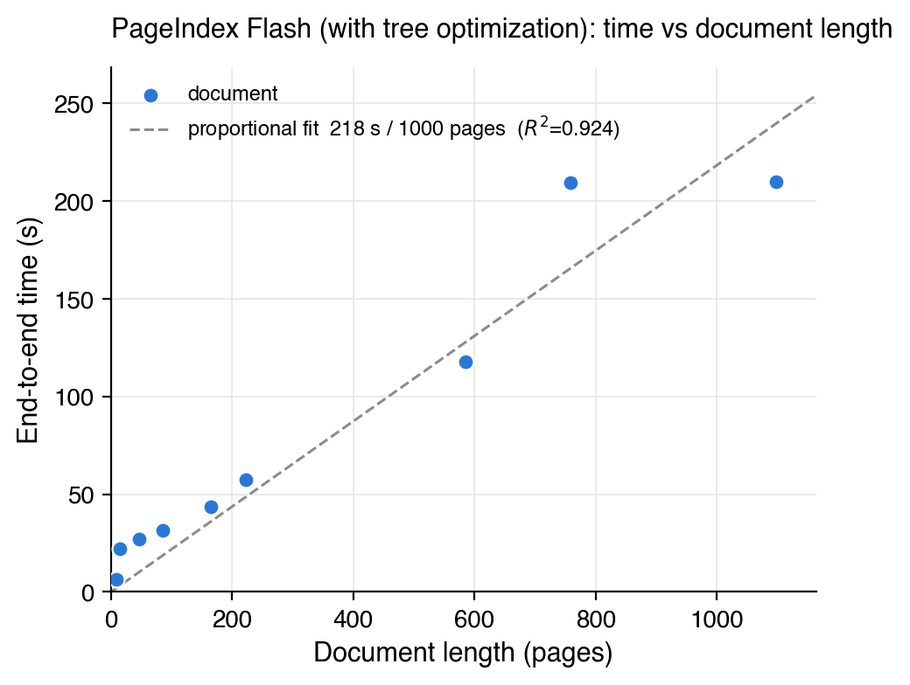
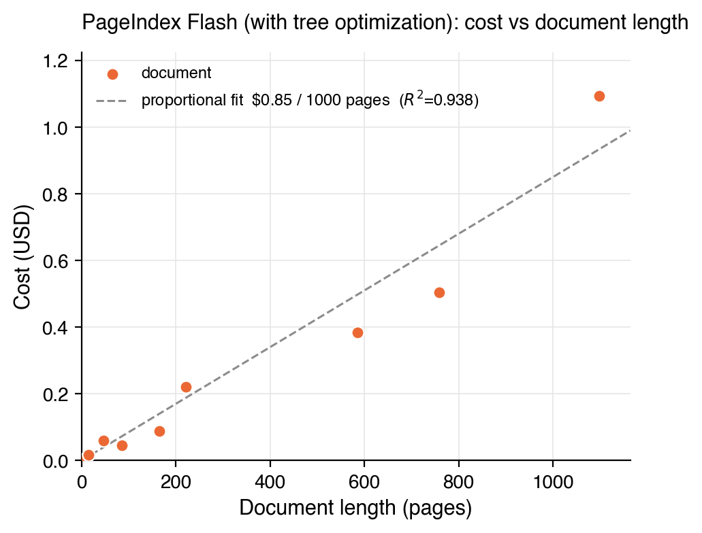

# PageIndex Flash

Builds a PageIndex tree structure from a PDF using layout statistics alone.
No LLM, no API key, no OCR, no network. Runs in seconds, fully offline.

## Usage

```python
from pageindex.flash import page_index_flash

tree = page_index_flash("paper.pdf")
```

```bash
python3 run_pageindex.py --pdf_path document.pdf --flash
```

Accepts a path (`str` or `pathlib.Path`) or an `io.BytesIO` stream. Raises on a
missing, non-PDF, encrypted, empty, or unreadable file.

## Output

```python
{
    "doc_name": str,
    "doc_title": str,
    "structure": [
        {
            "title": str,
            "node_id": str,       # 4-digit, zero-padded
            "start_index": int,
            "end_index": int,
            "key_items": [str],   # with --optimize: titles of merged-away subsections
            "nodes": [...],       # absent on leaf nodes
        }
    ],
}
```

Page indexes are 1-based. `nodes` nests the same shape recursively. Without
`--optimize` the extracted tree is returned as-is.

## Benchmark

Nine PDFs, each run end to end with tree optimization: PDF parse, layout
outline, merge, LLM expand, then a summary for every node.





Both scale close to linearly with length, at 218 s and $0.85 per 1,000 pages.
Two qualifiers. Cost follows node count a little more closely than page count,
$0.0007 to $0.0016 per node, so a densely structured document costs more than
its length suggests. And wall clock flattens past roughly 700 pages, where
summary concurrency rather than length becomes the limit.

| Document | Pages | Input tokens | Output tokens |
|---|---:|---:|---:|
| Bitcoin whitepaper | 9 | 8,715 | 4,673 |
| Attention Is All You Need | 15 | 26,805 | 10,183 |
| KIMI K3 | 47 | 85,704 | 35,217 |
| DeepSeek-R1 | 86 | 68,398 | 26,351 |
| Situational Awareness | 165 | 115,130 | 54,347 |
| Federal Reserve 2023 report | 222 | 280,975 | 136,982 |
| 9/11 Commission Report | 585 | 720,624 | 200,202 |
| Pattern Recognition and Machine Learning | 758 | 857,983 | 277,675 |
| Machine Learning: A Probabilistic Perspective | 1,098 | 1,587,265 | 646,958 |
| **Total** | **2,985** | **3,751,599** | **1,392,588** |

Measured with `gpt-5.6-luna` at $0.20 / $1.20 per million input / output tokens,
priced cold with no prompt-cache discount.

## Limits

- Scanned PDFs without embedded text are not supported.
- Encrypted PDFs need preprocessing first.
- Headings drawn as vector paths, or very decorative layouts, can be missed.
- Titles are taken from the document text as-is.

## Dependencies

`pypdfium2`, `PyPDF2`, `regex`, `sortedcontainers`.
